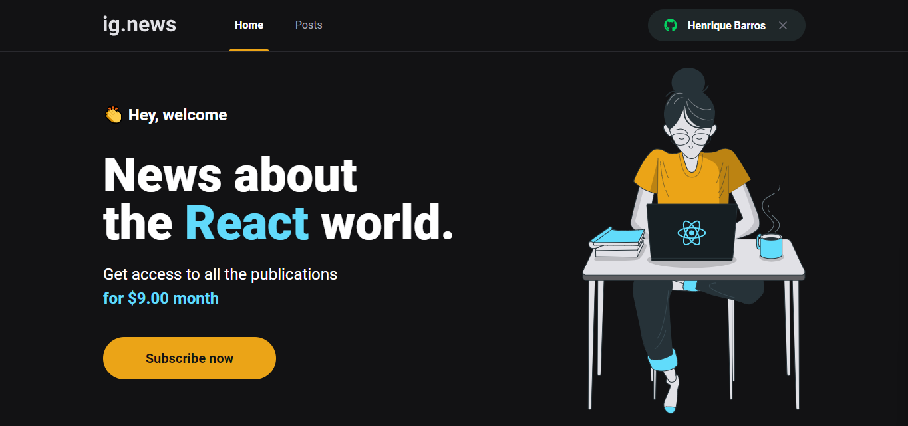
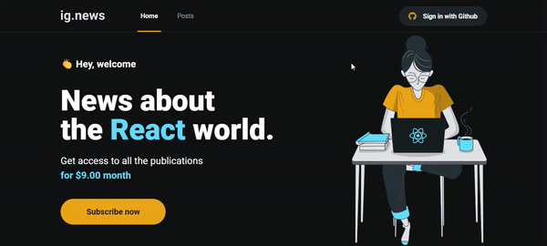
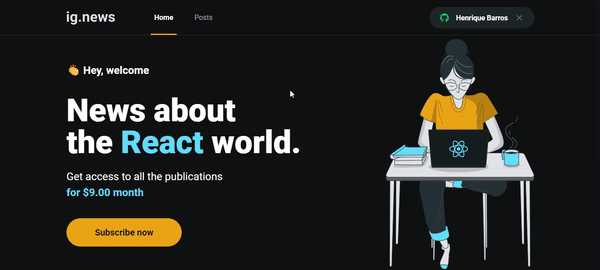

# Ignews

    

 

# Tecnologias

* [Typescript](https://www.typescriptlang.org/docs/handbook/typescript-in-5-minutes.html)
* [ReactJS](https://pt-br.reactjs.org/docs/getting-started.html)
* [NextJS](https://nextjs.org/docs/getting-started)
* [Sass](https://sass-lang.com/documentation)
* [API do Stripe (Pagamentos)](https://stripe.com/docs)
* [FaunaDB (Salvar dados do usuários)](https://docs.fauna.com/fauna/current/)
* [Prismic (Gerenciamento dos Posts)](https://prismic.io/docs)

 

# Fluxo da Aplicação para um usuário não conectado

> Quando o usuário ir para a rota de posts e selecionar algum, será mostrado parte do post e um botão para fazer a assinatura do blog.

    

 

# Fluxo do Aplicação para o usuário se conectar

    

# Fluxo do Aplicação para o usuário assinar o blog

    

